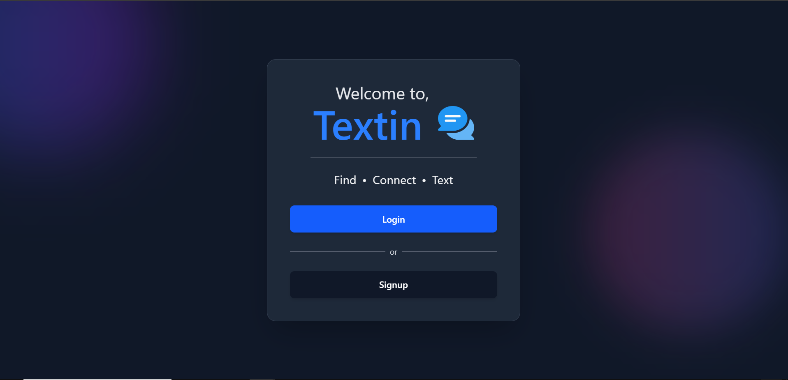
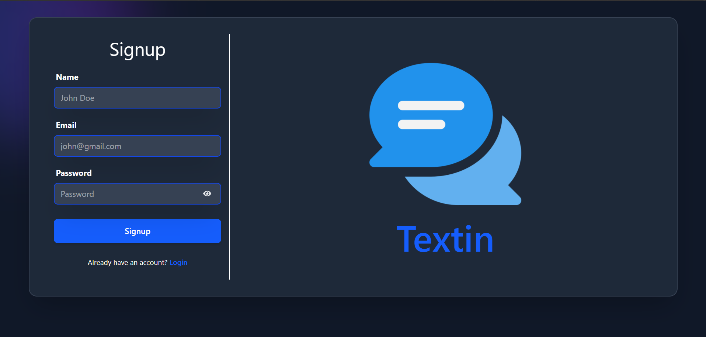
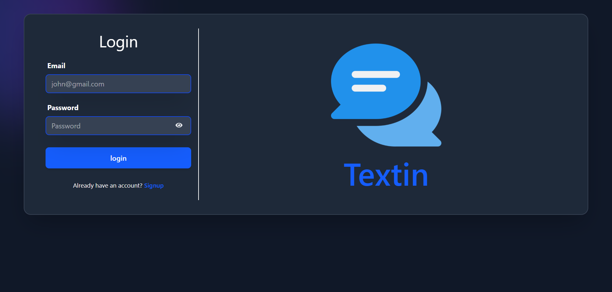
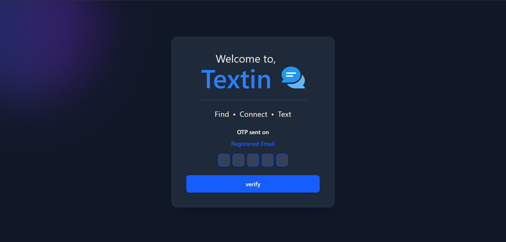
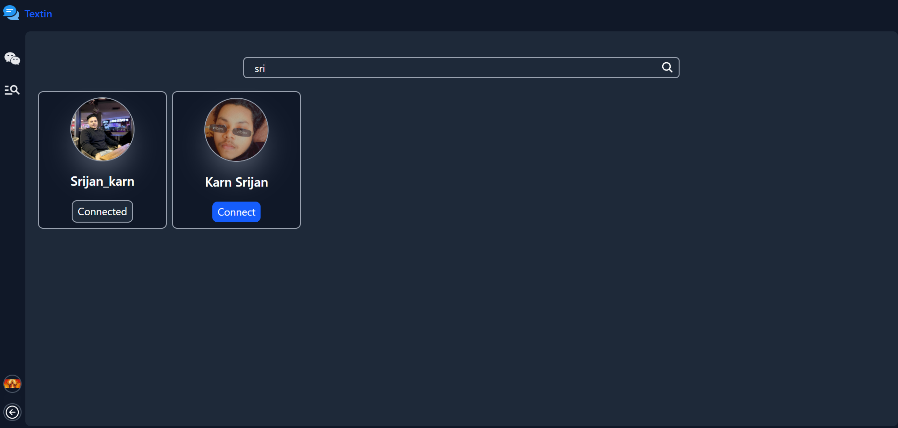
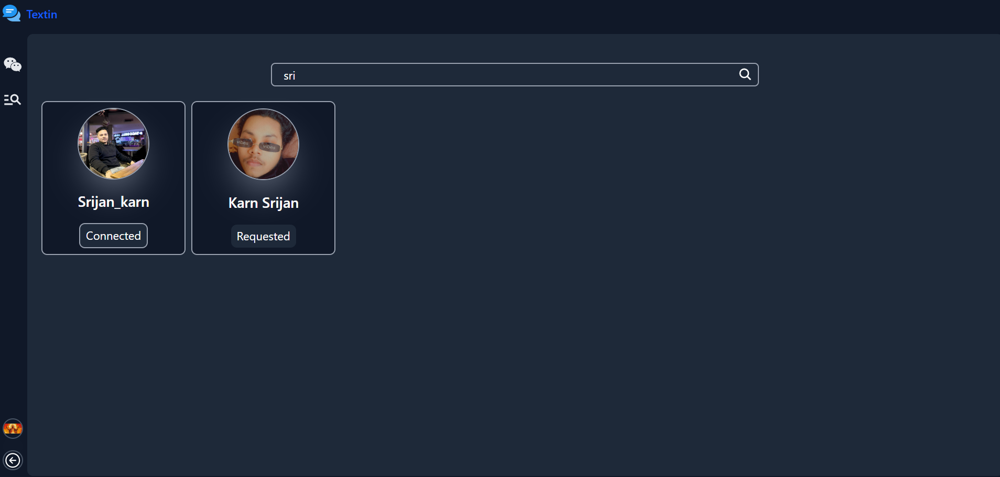
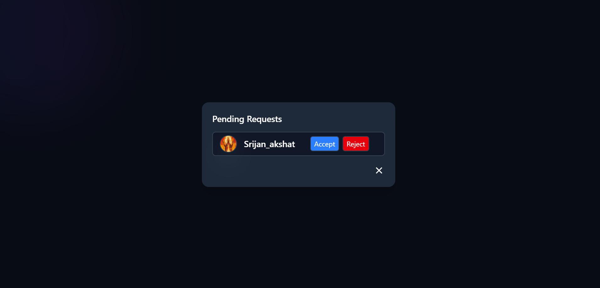
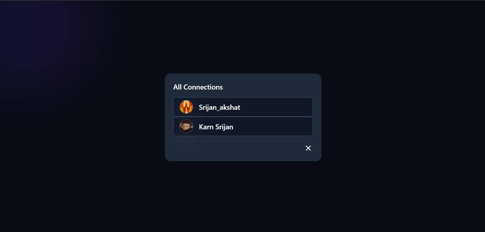
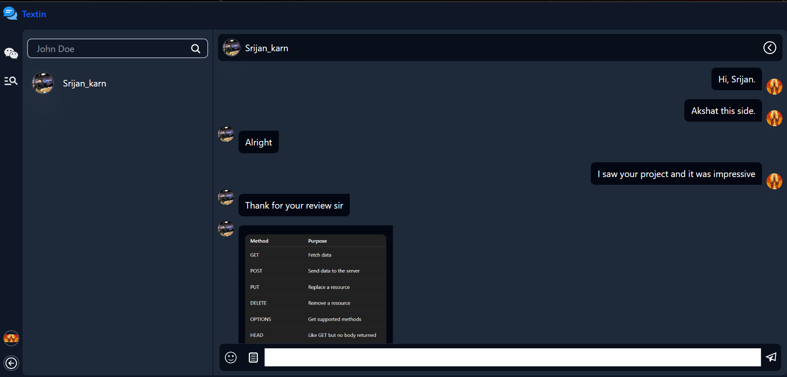
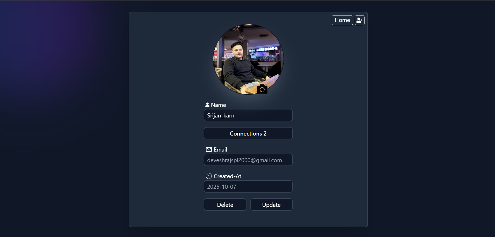

<h1>Textin — Real-Time Chat Application</h1>

Textin is a full-stack real-time chat application built with the MERN stack and Socket.IO, featuring secure authentication, user connections, and instant messaging.
Designed with scalability, modularity, and clean code architecture in mind, it demonstrates mastery over modern web development concepts such as JWT authentication, RESTful APIs, and real-time event communication.

<h2>🧠 Table of Contents</h2>
<ul>
  <li>Overview</li>
  <li>Tech Stack</li>
  <li>Features</li>
  <li>Installation & Setup</li>
  <li>Environment Variables</li>
  <li>Future Enhancements</li>
  <li>Author</li>
</ul>

<h2>🌍 Overview</h2>

Textin brings the essence of real-time communication into a simple, elegant web interface.
Users can create accounts, verify their emails via OTP, build connections, and chat instantly — powered by Socket.IO for bi-directional real-time event streaming.

This project focuses not only on user experience but also on the internal architecture that governs data security, authorization, and scalability — making it a showcase of advanced web engineering practices.

<h2>⚙️ Tech Stack</h2>

<b>Frontend:</b>

<ul>
  <li>React.js (Component-based UI)</li>
  <li>Redux Toolkit (State Management)</li>
  <li>Axios (API communication)</li>
  <li>Tailwind CSS (Styling)</li>
  <li>Emoji Picker, Image Upload Support</li>
</ul>

<b>Backend:</b>

<ul>
  <li>Node.js + Express.js (API server)</li>
  <li>MongoDB + Mongoose (Database ORM)</li>
  <li>Socket.IO (Real-time communication layer)</li>
  <li>JWT + Cookies (Authentication)</li>
  <li>Nodemailer + OTP Verification System</li>
</ul>

<b>Utilities:</b>

<ul>
  <li>Multer (File handling for image uploads)</li>
  <li>bcrypt.js (Password hashing)</li>
  <li>dotenv (Environment configuration)</li>
</ul>

<h2>💡 Features</h2>
<h3>🔐 User Authentication & Authorization</h3>
<ul>
  <li>Secure signup/login using JWT tokens stored in cookies.  </li>
  <li>Email verification through a OTP mechanism. </li>
  <li>Protected routes ensuring only verified users access critical endpoints.</li>
</ul>

<h3>🧑‍🤝‍🧑 User Search & Connections</h3>
<ul>
  <li>Search for users by username and view their profile image. </li>
  <li>Send/receive connection requests and manage them directly from the profile page. </li>
  <li>Accept/reject incoming requests seamlessly.  </li>
</ul>

<h3>💬 User Chat (One-to-One)</h3>
<b>Once connected, users can exchange:</b>
<ul>
  <li>Text messages</li>
  <li>Image messages</li>
  <li>Emojis</li>
</ul>
<b>All messages are delivered in real-time via Socket.IO. </b>

<h3>Real-Time Features</h3>
<ul>
  <li>🟢 Online/Offline Status: Users can see which of their connections are currently online.</li>
  <li>⚡ Instant Message Delivery: Socket.IO ensures low-latency message propagation.</li>
  <li>👤 User Profile Management</li>
</ul>

<h3>View personal details:</h3>
<ul>
  <li>username</li>
  <li>email</li>
  <li>account creation & update timestamps</li>
  <li>Manage pending connection requests</li>
  <li>Update username anytime</li>
</ul>
 
Each connected user establishes a WebSocket connection through Socket.IO, enabling event-driven communication without repeated HTTP requests.

<h2>🛠️ Installation & Setup</h2>
<h3>1️⃣ Clone the Repository</h3>
git clone https://github.com/thrivingSec/Textin.git 
cd Textin
<h3>2️⃣ Setup the Backend</h3>
cd backend 
npm install
<h3>3️⃣ Setup the Frontend</h3>
cd frontend 
npm install

<h3>4️⃣ Configure Environment Variables</h3>

<b>Create a .env file inside /backend with:</b>

PORT = 3000 
DB_URL = your mongodb connections string 
JWT_SECRET = your jwt secret key to encrypt password 
NODE_ENV = 'development' 
CLOUDINARY_API_SECRET=your cloudinary api secret 
CLOUDINARY_API_KEY=your cloudinary api key 
CLOUDINARY_CLOUD_NAME=your cloudinary cloudname 
COMPANY_EMAIL = your email 
COMAPNY_EMAIL_PASS = your email pass 

<h3>5️⃣ Run the Application</h3>
# Run backend 
<b>npm run dev</b> 
# Run frontend 
<b>npm run dev</b> 

<h2>🚀 Future Enhancements</h2>
<ul>
  <li>✍️ Typing Indicators</li>
  <li>🗑️ Account Deletion</li>
  <li>🔍 Search connected users directly from home page</li>
  <li>🧵 Group Chats & Media Attachments</li>
</ul>

<h2>👨‍💻 Author</h2>

<b>Developed by: Srijan</b> 
<b>Role: Full Stack Developer (MERN + Socket.IO)</b> 
<b>LinkedIn: www.linkedin.com/in/srijan-karn-81507b27a</b> 
<b>GitHub: github.com/thrivingSec</b> 

<h2>🧾 License</h2>
<b>This project is licensed under the MIT License — free for personal and educational use.</b>
